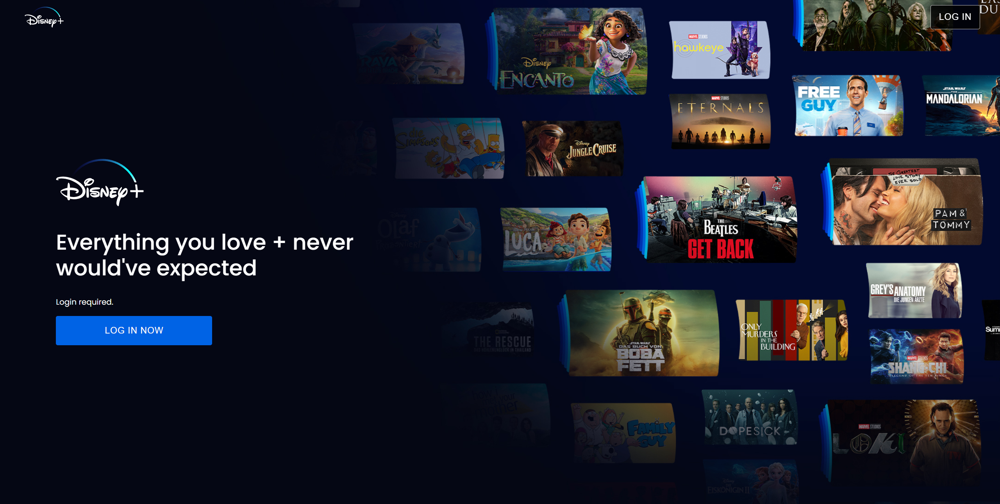
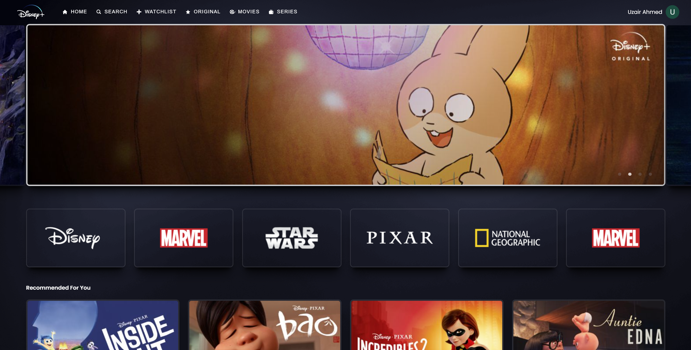
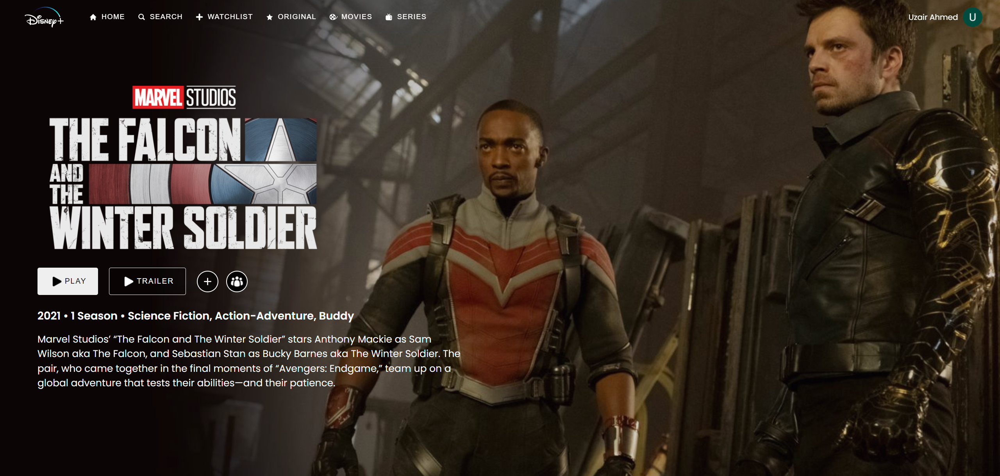

# disney-plus-clone
 
Disney plus clone made with React.js, typescript,, contextAPI and Firebase

[**Live Demo**](https://disney-clone-uzzii-21.netlify.app/)  





Built with:

- [React.js](https://reactjs.org/)
- [Styled components](https://styled-components.com/)
- [React router](https://reactrouter.com/docs/en/v6/getting-started/overview)
- [Slick carousel](https://kenwheeler.github.io/slick/)
- [Firebase](https://www.firebase.com/)


## Getting Started

1. Install dependencies

   ```bash
   yarn
   ```

2. Fire up the server and watch files

   ```bash
   yarn dev
   ```

## Build

1. Build

   ```bash
   yarn build
   ```

2. Build preview!

   ```bash
   yarn preview
   ```
